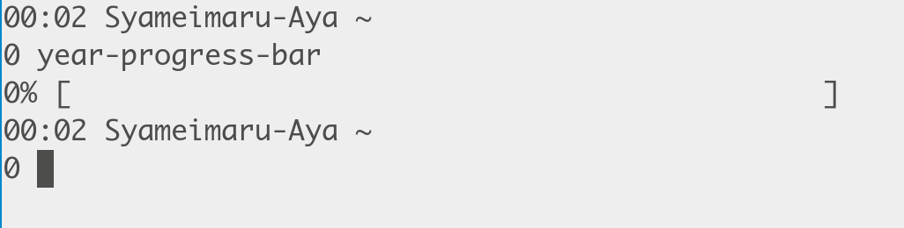
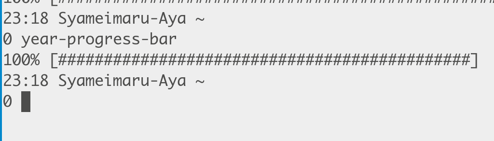

year progress bar

# 功能

这个命令会在终端画一个进度条，展示一年已经过去多少了。

这是一年的第一天：



这是一年的最后一天：



当进度条的槽填满的时候，意味着一年又要结束了。

# 依赖

* posix shell
* tput
* date

# 安装

仓库目录下的 `year-progress-bar` 就是可执行文件，把它放到你喜欢的路径里面就可以用了。

# 使用

安装完成后，运行 `year-progress-bar` 即可。

# 与 bash 集成

安装完成后，把下面的内容复制到你的 bash 配置文件中。

```
if [ -x "$(command -v year-progress-bar)" ]; then
    mkdir -p ~/.local
    touch ~/.local/year-progress-bar
    if ! [ "$(date +%j)" = "$(cat ~/.local/year-progress-bar)" ]; then
        if [ "$(date +%H)" -ge 4 ]; then
            date +%j > ~/.local/year-progress-bar
            year-progress-bar
        fi
    fi
fi
```

它实现的功能是：每天凌晨四点之后打开的第一个 bash 会运行这个命令，展示今年的进度条。
